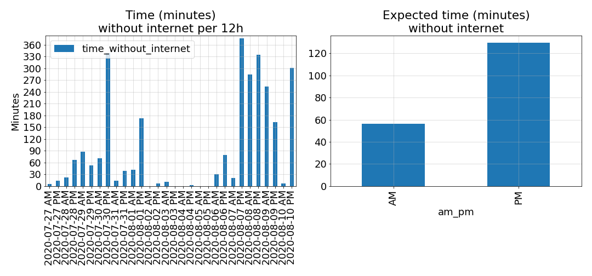

# ISP service level monitoring

A repo for monitoring your internet availability.



## Context
In the context of having to work from home, we are heavily dependant on the availability of the interet provided by our internet service provider (ISP). 

ISP typically have access to statistics about your interenet modem's up time. It would be interesting to have access to this information from a customer point of view. In that way, us, the customers, could discuss what the service level we are experience exactly is.

This repo is about just that: providing the tool to monitor your internet availability.

## Features description
* `code/fetch.py`: Implements a class doing a single call to an API that fetches the current time. It saves this information to disk.
* `code/analyzer.py`: Implements a class that does this analysis of the recorded data. This class:
  * Plots of the daily number of internet serivce interuptions
  * Plots the daily number of minutes without internet
  * Prints the percentage of time without internet
* `notebooks/plots-and-analysis.ipynb`: Reports on the internet service level received using `code/analyzer.py`.
* `Pipfile`: File for handling python dependencies with [pipenv](https://github.com/pypa/pipenv)

## Install
```
$ cd ./ISP-service-level-monitoring
$ python -m pipenv install
```

And then add this line to your `crontab` to run `code/fetch.py` every minute.

```
* * * * * cd /path/to/ISP-service-level-monitoring/code && python -m pipenv run python fetch.py > /dev/null 2>&1"
```

## Testing
Simply run `pipenv run python -m pytest -vv`

## License

[MIT](https://github.com/alexantoinefortin/ISP-service-level-monitoring/blob/master/LICENSE)